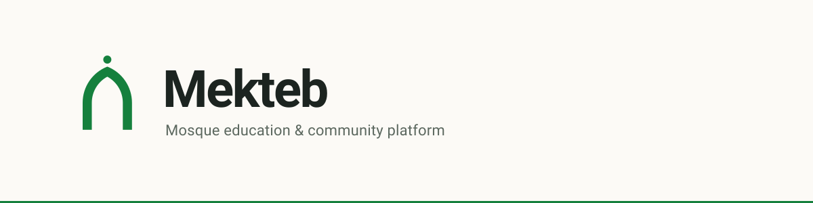
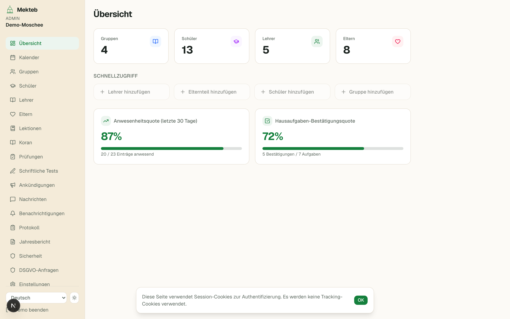
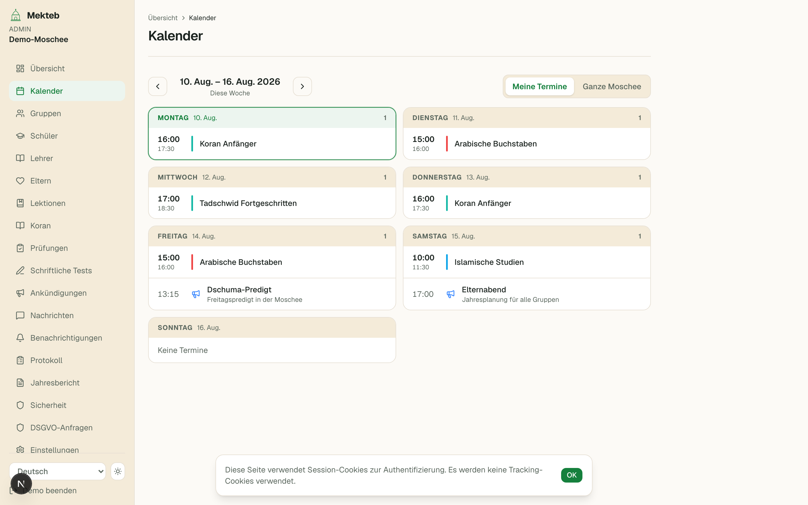
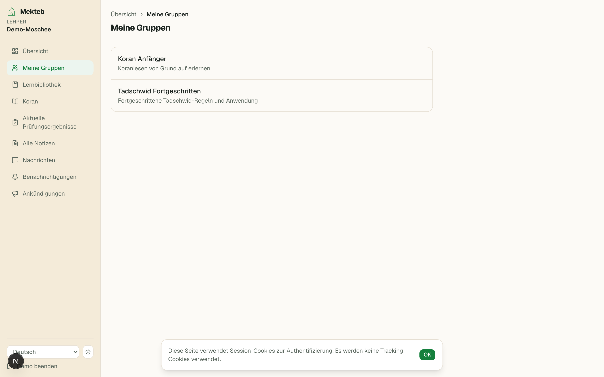
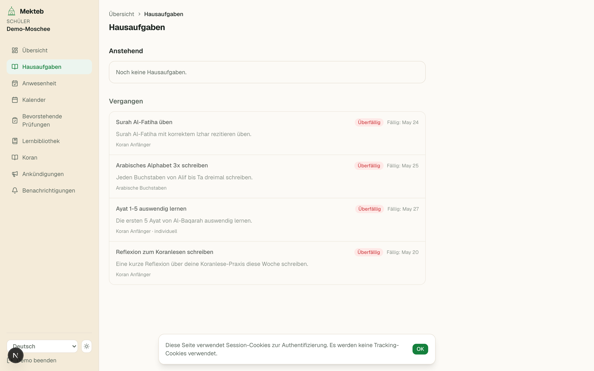
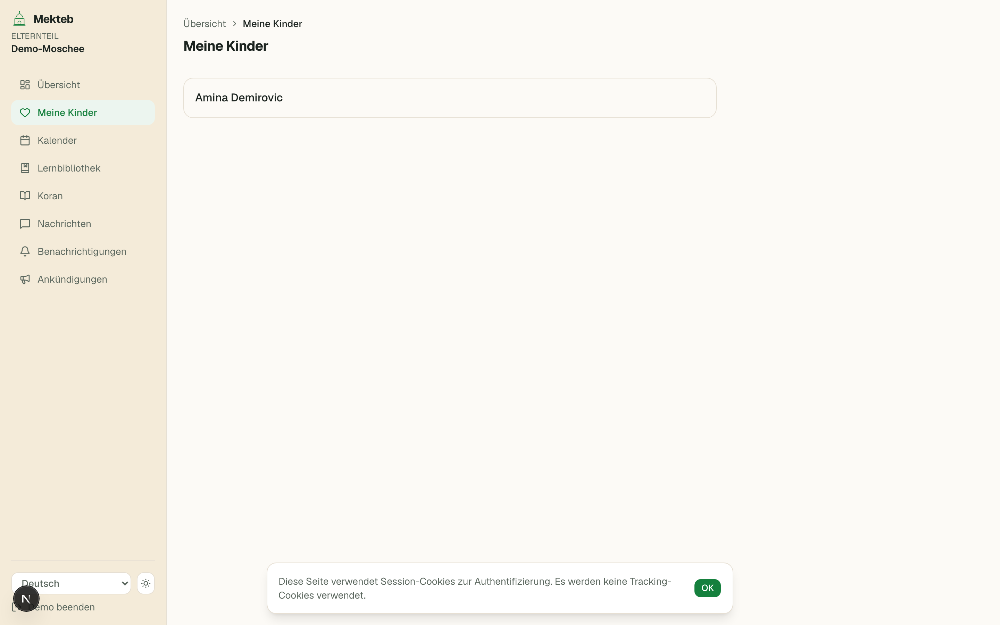
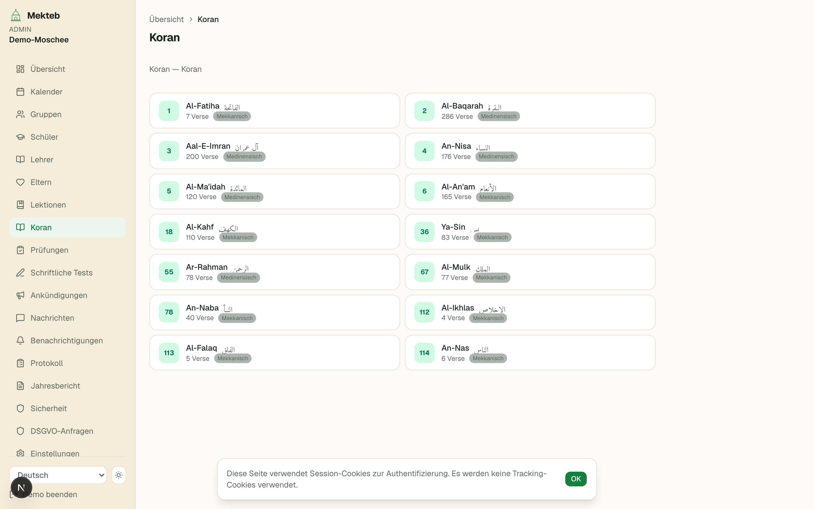

<p align="center">
  <picture>
    <source media="(prefers-color-scheme: dark)" srcset="assets/brand/header-dark.svg">
    
  </picture>
</p>

# Mekteb

Mosque education & community platform: manage students, teachers, groups,
attendance, homework, exams, announcements and messaging — in the browser and
on a native iOS/Android app.

A **pnpm monorepo** built on **Next.js (App Router)** + **Supabase**
(PostgreSQL, Auth, Storage) with a shared, fully localised UI catalogue.

[](https://vercel.com/new/clone?repository-url=https://github.com/sanid/mekteb&root-directory=apps/web&env=NEXT_PUBLIC_SUPABASE_URL,NEXT_PUBLIC_SUPABASE_ANON_KEY,SUPABASE_SERVICE_ROLE_KEY,RESEND_API_KEY,EMAIL_FROM,NEXT_PUBLIC_SITE_URL,CRON_SECRET&envDescription=Required%20environment%20variables%20for%20Mekteb%20(Supabase%20keys%2C%20Resend%20email%2C%20site%20URL%2C%20cron%20secret)&envLink=https://github.com/sanid/mekteb/blob/main/apps/web/.env.example&project-name=mekteb&repository-name=mekteb)

---

## Screenshots

All 53 screenshots of the web app (every role, German locale, sample data) live
in [`assets/screenshots/`](assets/screenshots/) and are browsable in the
gallery on the [landing page](https://github.com/sanid/mekteb). A few key views:

<p>
  
  
  
</p>
<p>
  
  
  
</p>

To regenerate them, see [Regenerating the screenshots](#regenerating-the-screenshots).

---

## What is Mekteb

- **Web portal** (`apps/web`): portals for admins, teachers, parents, students
  and examiners, plus cross-mosque platform administration — dashboard,
  calendar, groups, attendance, homework, lessons, exams, messaging,
  announcements, reports and billing.
- **Mobile app** (`apps/mobile`): a native Expo app (iOS + Android) that stays
  in sync with the web portal, with push notifications and home-screen
  widgets.
- **Multi-tenant by design**: `mosque_id` scoping and tenant-aware Row-Level
  Security from day one, so one deployment can serve a single mosque or a
  whole SaaS platform without architectural rewrites.
- **Fully localised**: German (default), English, Bosnian and Turkish — every
  user-facing string comes from one shared catalogue.

## Tech stack

| Layer      | Choice                                                                                    |
|------------|-------------------------------------------------------------------------------------------|
| Web        | Next.js (App Router), React 19, TypeScript, Tailwind CSS v4, shadcn/@base-ui, next-intl    |
| Mobile     | Expo SDK 57, React Native, expo-router, native widgets (iOS WidgetKit / Android Glance)     |
| Backend    | Supabase (Postgres, Auth, Storage, Edge Functions), 123 documented endpoints under `apps/web/src/app/api` (browsable at `/docs/api` in a running instance) |
| Payments   | Stripe                                                                                     |
| Email      | Resend                                                                                     |
| Infra      | Vercel, Upstash Redis (rate limiting), Sentry (error monitoring), PWA                       |
| i18n       | `packages/i18n` — de / en / bs / tr, ~2,370 keys shared by web and mobile                  |

## Repository structure

```
mekteb/
├── apps/
│   ├── web/                   # Next.js web app + API + Playwright/vitest tests
│   └── mobile/                # Expo (React Native) app + native widgets
├── packages/
│   └── i18n/                  # Shared translation catalogue (de, en, bs, tr)
├── assets/screenshots/        # Full-page screenshots of every web portal role
├── supabase/
│   ├── migrations/            # Pure SQL migrations (source of truth)
│   ├── tests/                 # pgTAP database tests (RLS, roles, tenant isolation)
│   └── seed*.sql              # Local seeds (seeded logins use 'Mekteb2026!')
├── docs/                      # End-user handbook + setup guide (German)
└── .github/workflows/ci.yml   # Typecheck, lint, i18n, unit, db and e2e CI
```

## Portals & features

- **Admin** (`/admin`): groups, students, teachers, parents, lessons & topics,
  exams & written tests, announcements, messages, notifications, calendar,
  attendance, audit log, annual report, security, GDPR and settings
  (branding, billing, plugins, diplomas).
- **Teacher** (`/teacher`): assigned groups, attendance, homework (group or
  individual), progress & weekly notes, exam results, Quran reader, messages.
- **Parent** (`/parent`): children's attendance, homework, progress notes,
  lesson library, calendar, Quran reader, messages.
- **Student** (`/student`): own groups, homework, attendance, exams, lessons,
  Quran reader and announcements.
- **Examiner** (`/examiner`): conduct oral and written exams, grade, generate
  diplomas.
- **Platform admin** (`/platform-admin`): cross-mosque management, billing,
  GDPR deletion log.
- **Quran reader** (every portal): reciter-selected audio streaming, saved
  ayahs with notes, hifz progress tracking.
- **Demo mode**: `/demo` renders every role's screens with sample data — no
  login or database required (this is what the screenshots above are captured
  from).

## Architecture & design decisions

### Multi-tenancy & security first

- **RLS on everything**: every business table has Row-Level Security enabled;
  nothing trusts frontend parameters.
- **Denormalised `mosque_id` + invariant triggers**: tables carry `mosque_id`
  for fast, simple RLS; `BEFORE INSERT OR UPDATE` triggers on link tables
  reject inserts whose foreign keys point to different mosques.
- **Auth identity vs. mosque membership**: `auth.users → profiles` is decoupled
  from `memberships`, which maps users to roles (`platform_owner`,
  `mosque_admin`, `teacher`, `parent`, `student`) within a `mosque_id`. Users
  can hold different roles in different mosques.

### Onboarding & authentication

- **No public signups**: admins provision accounts
  (`createTeacherAccount` / `createParentAccount` server actions). Appointing
  a mosque admin promotes an existing account, or creates one on the spot when
  the address is unknown (`createAndAppointAdmin`).
- **Temporary passwords & OTP lifecycle**: onboarding generates a temporary
  password and a pending `otp_issues` record; the first login forces a
  password rotation (`must_rotate_password`).
- **MFA**: TOTP enrollment (e.g. Google Authenticator) from the portal
  settings.
- **Audit logging**: onboarding, login, logout, password resets and other
  sensitive actions are recorded in `audit_logs` and `password_reset_audit`.
- **Students have no email**: they sign in with a mosque-qualified username
  (e.g. `al-nour.amina`); the sign-in field accepts an email *or* that.

### Internationalisation

- German is the default locale, with English, Bosnian and Turkish fully
  supported via `next-intl`.
- All page files live under `src/app/[locale]/…`; the shared catalogue lives in
  `packages/i18n/messages/{de,en,bs,tr}.json`.
- **Rule**: any user-facing text must be added to **all four** locale files —
  `pnpm check:i18n` enforces key parity in CI.
- Use `getLocale()` from `next-intl/server` in server actions/redirects so the
  locale prefix is preserved.

---

## Local development

### Prerequisites

- **Node 24+** and **pnpm 10** (`corepack enable`)
- **Docker Desktop** + **Supabase CLI** (`brew install supabase/tap/supabase`)
- Web: nothing else. Mobile: Xcode/Android Studio and a simulator.

### 1. Install dependencies

```bash
pnpm install
```

### 2. Start the local database stack

Spins up PostgreSQL, Auth (GoTrue), Storage, Studio and Inbucket (local email
testing) in Docker:

```bash
pnpm db:start
```

### 3. Configure environment variables

```bash
cp apps/web/.env.example apps/web/.env.local
```

Fill in the keys printed at the end of `db:start` (or via `supabase status`):
`NEXT_PUBLIC_SUPABASE_URL`, `NEXT_PUBLIC_SUPABASE_ANON_KEY` and
`SUPABASE_SERVICE_ROLE_KEY`. Add optional keys for Stripe, Resend, Upstash and
Sentry as needed — see [`apps/web/.env.example`](apps/web/.env.example).

### 4. Generate TypeScript types

```bash
pnpm db:types
```

### 5. Run the web app

```bash
pnpm dev        # → http://localhost:3000
```

Supabase Studio is available at http://127.0.0.1:54323.

### 6. Run the mobile app

Expo Go **cannot** run this app — the widgets require a development build:

```bash
pnpm --filter mobile ios      # or: pnpm --filter mobile android
```

Run `pnpm --filter mobile prebuild` before first launch, or use EAS builds
(see `apps/mobile/eas.json`).

---

## Testing

| Suite        | Command                       | What it covers                                                    |
|--------------|-------------------------------|-------------------------------------------------------------------|
| Unit         | `pnpm test`                   | Vitest — helpers, site gate, API logic (in `apps/web`)             |
| E2E          | `pnpm test:e2e`               | Playwright — auth, login, demo calendar, student flows             |
| Database     | `supabase test db`            | pgTAP — RLS, role capabilities, tenant isolation, messaging        |
| i18n         | `pnpm check:i18n`             | Translation key parity across de / en / bs / tr                    |
| Routes       | `pnpm check:routes`           | Internal links resolve                                             |
| Typecheck    | `pnpm typecheck`              | `tsc --noEmit` for `apps/web`                                      |
| Lint         | `pnpm lint`                   | ESLint for `apps/web`                                              |

The Playwright e2e suite shares the rate-limited login budget: authentication
happens once in `apps/web/e2e/auth.setup.ts`, which signs each seeded role in
and writes `storageState` files that the other specs reuse.

## Regenerating the screenshots

The screenshots in `assets/screenshots/` are captured from the `/de/demo` page
via a Playwright script — no database or login needed:

```bash
pnpm --filter web dev          # in one terminal
node apps/web/scripts/screenshot-demo.mjs   # in another
```

Options (via env): `BASE_URL`, `SCREENSHOT_LOCALE` (default `de`). The demo
banner is hidden in the captures; comment out `HIDE_BANNER` in the script to
keep it.

Captures are full-page, so a long screen comes out taller than the usual
2880×1800 — nine of the 53 do. The grid above sets `width="30%"` and lets the
height follow, so swapping one of those in makes its tile overhang the row.
Pick a 2880×1800 capture for that grid, or crop first.

---

## Database migrations

Migrations live in `supabase/migrations` (currently 116). When pulling new
migrations or changing schema:

```bash
pnpm db:reset   # Wipes local DB, replays migrations, runs seed.sql
pnpm db:types   # Regenerates TypeScript types
```

To create a new migration:

```bash
pnpm db:diff my_migration_name        # capture manual changes from Studio
# or
supabase migration new my_migration_name
```

## Documentation

| Document                                      | Audience           | Description                                        |
|-----------------------------------------------|--------------------|----------------------------------------------------|
| [`apps/web/public/docs/index.html`](apps/web/public/docs/index.html)          | End users (de)     | Handbook for admins, teachers, parents and students |
| [`apps/web/public/docs/setup-guide.html`](apps/web/public/docs/setup-guide.html) | New admins         | Interactive first-setup checklist for a mosque      |
| API reference (`/docs/api`)                   | Developers         | Interactive OpenAPI docs (all `/api/v1` + internal endpoints); spec served at `/api/docs/openapi.json`, source in [`apps/web/src/lib/api-docs/`](apps/web/src/lib/api-docs/) |
| [`AGENTS.md`](AGENTS.md)                      | AI tooling         | Working rules for agents editing the codebase      |
| [`CONTRIBUTING.md`](CONTRIBUTING.md)          | Contributors       | Ground rules, checks to run, migration workflow     |

## Deployment checklist

Before deploying the web app to Vercel:

1. **Sentry**: set `NEXT_PUBLIC_SENTRY_DSN` (and `SENTRY_AUTH_TOKEN` /
   `SENTRY_ORG` / `SENTRY_PROJECT` for source-map uploads).
2. **GDPR**: sign the GDPR Data Processing Agreement in the Supabase Dashboard
   (Settings → Legal).
3. **Performance indexes**: confirm the indexes in
   `20260430000001_performance_indexes.sql` are applied.
4. **Service keys**: keep `SUPABASE_SERVICE_ROLE_KEY` server-side only — never
   expose it to the browser.
5. **Site gate**: set `SITE_GATE_PASSWORD` to put the pre-launch curtain in
   front of the public marketing pages (leave blank to disable).
6. **Impressum**: set `NEXT_PUBLIC_OPERATOR_NAME`, `NEXT_PUBLIC_OPERATOR_STREET`,
   `NEXT_PUBLIC_OPERATOR_POSTAL_CITY` and `NEXT_PUBLIC_CONTACT_EMAIL`. A site
   reachable from Germany needs a valid § 5 TMG disclosure; the repository
   ships no operator details, so the Impressum page is blank until you do.
7. **Cron**: protect the scheduled endpoints with `CRON_SECRET` —
   `/api/notifications/send-emails`, `/api/notifications/send-push` and
   `/api/reports/send-cards` (see `vercel.json`). The push job additionally
   accepts `PUSH_WEBHOOK_SECRET`, which the database trigger uses to deliver a
   notification the moment it is queued.

## Continuous integration

`.github/workflows/ci.yml` runs on every push to `main` and on pull requests:

- **ci**: dependency audit, typecheck, lint, i18n completeness, internal-route
  checks, unit tests
- **db-tests**: starts Supabase and runs the pgTAP suite
- **e2e**: starts Supabase, seeds local env, installs Playwright Chromium and
  runs the smoke tests
